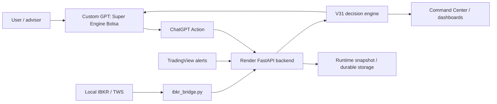

# Stock Ultimus Third-Party Installation Guide

Stock Ultimus can be packaged as a local/cloud decision-support engine connected
to a custom GPT interface. It must be sold and operated as analytics,
monitoring, explanation, and manual-review tooling. It must not be positioned as
an automatic trading system.

## Target Architecture



## What Gets Installed

- Local project folder with `ibkr_bridge.py`, validation scripts, docs, and
  runtime tools.
- Render FastAPI deployment for read-only GPT/dashboard endpoints and snapshot
  ingest.
- Custom GPT Action schema served from
  `/super_engine_bolsa_gpt_action_openapi.yaml`.
- ChatGPT Action authentication using `X-Stock-Ultimus-Read-Token`.
- Operator suite at `/v31_operating_suite` for command center, manual review,
  outcome tracking, learning, risk profiles, and commercial gates.
- Optional TradingView alerts posting to `/technical_snapshot`.
- Optional durable storage through Supabase/Postgres before commercial use.

## Required Secrets

Never place secrets in GPT instructions, screenshots, docs, dashboards,
fixtures, or logs.

Required:

- `READ_ACCESS_TOKEN`: protects GPT and dashboard read endpoints.
- `SNAPSHOT_INGEST_TOKEN`: protects snapshot publishing from the local bridge.

Recommended for production:

- `WEBHOOK_SECRET`: protects external TradingView-style webhook writes.
- Supabase/Postgres credentials for durable storage.
- Separate tokens per customer/account.

## Installation Checklist

1. Clone or copy the project onto the target computer.
2. Install Python dependencies needed by the bridge and validation scripts.
3. Configure IBKR/TWS paper or live read access. Do not enable automatic order
   execution.
4. Store local secrets in the OS keychain or environment variables.
5. Deploy the FastAPI app to Render or an equivalent private host.
6. Configure Render environment variables for read auth and ingest auth.
7. Import the GPT Action schema into the customer's custom GPT.
8. Configure the GPT Action API key:
   `X-Stock-Ultimus-Read-Token: <READ_ACCESS_TOKEN>`.
9. Run production read-auth verification.
10. Run the local bridge once during a valid market/options window.
11. Confirm `/gpt_v31_daily_rankings` returns a data readiness status and
    decisions without exposing secrets.
12. Confirm `/gpt_v31_daily_answer` returns a safe Spanish response with
    `execution_authorized=false`.
13. Open `/v31_operating_suite` and confirm manual review, outcome tracking,
    learning, and risk profile sections are present.
14. Confirm every candidate remains manual-review only and
    `execution_authorized` is false.

## Risk Profile Setup

Choose one preset per customer/account:

```text
V31_RISK_PROFILE_PRESET=conservative
V31_RISK_PROFILE_PRESET=balanced
V31_RISK_PROFILE_PRESET=aggressive
V31_RISK_PROFILE_PRESET=paper
```

`balanced` is the default. You can still override individual limits with
`V31_MIN_DTE`, `V31_MAX_DTE`, `V31_MIN_ABS_DELTA`, `V31_MAX_ABS_DELTA`,
`V31_MAX_SPREAD_PCT`, `V31_MAX_ABS_SPREAD`, `V31_MIN_BID`,
`V31_MIN_OPTION_SCORE`, and `V31_MIN_TECH_SCORE`.

For commercial installs, each customer should have a documented profile and a
change log. A looser profile should be treated as a research/paper setting until
enough audited outcomes exist.

## Operating Model

Daily flow:

1. Start TWS/IBKR and confirm market data permissions.
2. Run `ibkr_bridge.py` to publish a fresh snapshot.
3. Confirm TradingView alerts are arriving if technical signals are required.
4. Ask the GPT: "Que oportunidades tengo hoy?"
5. Review `top_manual_review`, `watchlist`, `blocked`, `research_only`, and
   `data_readiness`.
6. Open `/v31_manual_review_console` to record reviewing, watchlist, rejection,
   expiration, or manual approval.
7. Use `/v31_outcome_tracking_status`, `/v31_evaluate_pending_outcomes`, and
   `/v31_manual_review_learning` to track what happened after signals.
8. For any candidate, open ticker detail before acting.
9. Manually validate sizing, spread, liquidity, event risk, account risk, and
   broker data.

## Commercial Readiness Gates

Before selling this as a managed product, require:

- Legal/compliance review for investment-advice and trading-tool positioning.
- Customer/account isolation.
- Separate tokens and secrets per customer.
- Durable audit logging.
- Risk profile configuration per customer.
- Clear disclosures that outputs are decision support, not orders or advice.
- Paper-trading or simulation mode for onboarding.
- Support process for stale data, broker outages, token rotation, and incident
  logs.

## Customer Handoff Checklist

- Confirm GPT Action uses only the customer's backend URL and read token.
- Confirm the bridge publishes only that customer's account/watchlist snapshot.
- Confirm `/v31_operating_suite` shows the correct active risk profile.
- Confirm `/v31_manual_review_console` records manual decisions.
- Confirm outcome tracking is durable before using results for parameter
  changes.
- Confirm the customer has written disclosures and a support path for data
  outages.

## Expected GPT Behavior

When data is available, the GPT should summarize:

- candidates ready for manual review,
- blockers and missing fields,
- selected contract data,
- freshness,
- next required validation.

When `data_readiness.status` is `NO_DATA`, the GPT should not invent market
ideas. It should explain why the radar is blocked and list the next operational
actions: refresh IBKR snapshot, confirm TradingView alerts, or inspect ticker
detail.

## Non-Negotiable Boundary

Stock Ultimus does not submit live orders automatically. `ENTRY_READY` means
"ready for manual review", not authorization to trade.
